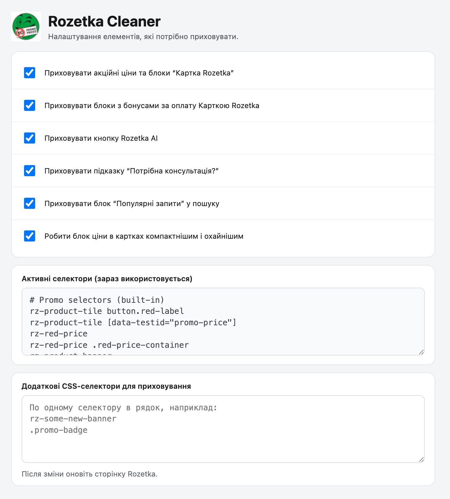

# Rozetka Cleaner

Легке Chrome-розширення, яке прибирає зайву промо-інформацію на Rozetka і робить сторінки чистішими та зручнішими.

  

## Що робить

- Ховає акційні ціни для "Картки Rozetka" у каталозі.
- Ховає великі промо-блоки з ціною "при оплаті Карткою Rozetka" на сторінці товару.
- Ховає рекламний банер Картки Rozetka на сторінці товару.
- Ховає рекламні каруселі з заголовком "Реклама" і рекламні картки товарів.
- Ховає блок "Швидкі фільтри".
- Ховає кнопку `Rozetka AI` та підказку "Потрібна консультація?".
- Ховає блок "Популярні запити" у пошуку.
- Робить блок ціни в картках товарів охайнішим:
  - стара ціна зверху;
  - актуальна ціна знизу;
  - компактний розмір шрифту актуальної ціни.

  
   
  До/після: чистіший каталог без промо-ціни та зайвих банерів

## Встановлення

1. Скачайте розширення на комп'ютер:
   - Варіант A: натисніть `Code` -> `Download ZIP` у репозиторії GitHub.
   - Варіант B: виконайте `git clone` і отримайте локальну папку проєкту.
2. Якщо скачали ZIP, розпакуйте його в окрему папку.
3. Відкрийте Chrome і перейдіть на `chrome://extensions`.
4. Увімкніть `Developer mode` (перемикач праворуч угорі).
5. Натисніть `Load unpacked`.
6. Виберіть папку, де лежать файли розширення (`manifest.json`, `content.js`, `styles.css`).
7. Відкрийте Rozetka і оновіть сторінку.

## Налаштування

Усе налаштовується перемикачами, без редагування коду:

1. `chrome://extensions` -> знайдіть Rozetka Cleaner.
2. Натисніть `Details` -> `Extension options`.
3. Оберіть потрібні перемикачі:
   - **Прибрати додаткову ціну “за Карткою Rozetka”**
   - **Прибрати бонусні блоки за оплату карткою**
   - **Прибрати рекламні каруселі та рекламні картки**
   - **Прибрати блок “Швидкі фільтри”**
   - **Прибрати кнопку Rozetka AI**
   - **Прибрати картку “Потрібна консультація?”**
   - **Прибрати блок “Популярні запити”**
   - **Зробити відображення ціни більш компактним**
4. Якщо потрібно точне налаштування, відкрийте "Розширені налаштування":
   - додайте власні CSS-селектори (по одному в рядок);
   - за потреби оновіть фрази для запасного пошуку по тексту.

  
   
  Сторінка налаштувань: усі перемикачі та додаткові селектори

### Що таке "Активні селектори"

У `Extension options` є блок **"Технічні правила, які зараз використовуються"**.
Це список правил, за якими розширення ховає елементи.
Звичайному користувачу він не потрібен: якщо користуєтесь лише перемикачами, цей блок можна ігнорувати.

## Де працює

- Працює на сторінках `*.rozetka.com.ua`
- Каталог
- Пошук і головна
- Сторінка товару (включно з рекламними каруселями, рекламними картками та блоком "Швидкі фільтри")

## Конфіденційність

- Розширення не збирає персональні дані.
- Розширення не передає дані на сторонні сервери.
- Розширення працює локально у вашому браузері лише на `rozetka.com.ua`.

## Якщо щось не спрацювало

1. Перезавантажте розширення в `chrome://extensions` (`Reload`).
2. Оновіть сторінку Rozetka.
3. Перевірте, чи увімкнені потрібні опції в `Extension options`.

## Важливо

- Проєкт не афілійований з Rozetka.
- Використовуйте на власний розсуд: сайт може змінювати верстку, і селектори потребуватимуть оновлень.
