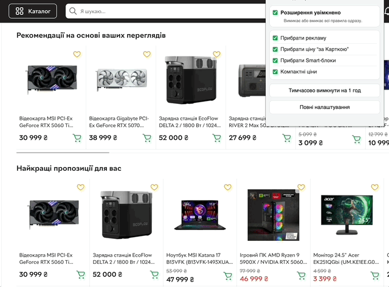

# Rozetka Cleaner

Rozetka Cleaner — це просте розширення для Chrome, яке робить сторінки Rozetka чистішими та спокійнішими.

Воно прибирає зайві промо-блоки, рекламу і частину відволікаючих елементів, щоб вам було легше зосередитися на товарі, ціні та характеристиках.

  

## Для кого це

- Для тих, хто хоче бачити менше зайвого на сторінках Rozetka.
- Для тих, кого дратують рекламні вставки та промо-картки.
- Для тих, хто хоче швидко переглядати товари без візуального шуму.

## Що робить розширення

Після встановлення ви можете одним кліком вмикати або вимикати потрібні пункти. Розширення допомагає:

- прибрати зайві промо-блоки;
- прибрати рекламні елементи;
- прибрати Smart/email банери;
- зробити перегляд каталогу та товарних карток зручнішим.

  
   
  Приклад: чистіший каталог без зайвих елементів

## Як встановити

1. Завантажте цей репозиторій (`Code` -> `Download ZIP`) і розпакуйте архів.
2. Відкрийте в Chrome сторінку `chrome://extensions`.
3. Увімкніть `Developer mode` (перемикач справа вгорі).
4. Натисніть `Load unpacked`.
5. Виберіть папку з розширенням.
6. Відкрийте Rozetka та оновіть сторінку.

## Як користуватися

1. Відкрийте `chrome://extensions`.
2. Знайдіть `Rozetka Cleaner` -> `Details` -> `Extension options`.
3. Увімкніть тільки ті пункти, які вам потрібні.

  
   
  Усі налаштування — у простих перемикачах

## Якщо щось не спрацювало

1. У `chrome://extensions` натисніть `Reload` для Rozetka Cleaner.
2. Оновіть вкладку Rozetka.
3. Перевірте, чи увімкнені потрібні перемикачі в налаштуваннях.

## Конфіденційність

- Розширення не збирає персональні дані.
- Розширення не передає дані на сторонні сервери.
- Усе працює локально у вашому браузері.

## Важливо

- Проєкт не афілійований з Rozetka.
- Іноді після змін на сайті можуть знадобитися оновлення розширення.
